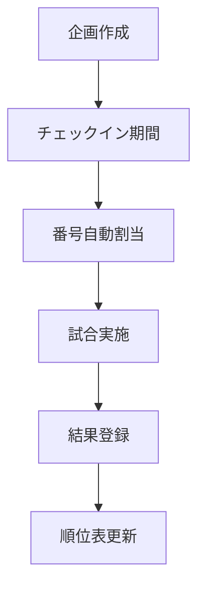
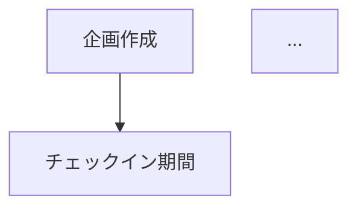

## TL;DR

- AI に「flow.md」を渡して大規模機能を実装させたら、認可ゼロ・冪等性破綻・型変換バグだらけの 6000 行 PR が出てきた
- 原因は「flow 図 = 仕様書」と思っていたこと。**flow 図は仕様の 30%** にすぎない
- 仕様書には 4 つの軸が必要: **functional / threat / resilience / plan**
- 4 つの軸を別ファイルとして 10〜15 分ずつ書く方が、巨大な 1 枚 spec より現実的
- この記事では各軸のテンプレを示す

## この記事でできること

| やりたいこと | この記事で得られるもの |
|---|---|
| AI に渡す仕様書に何を書けばいいか知りたい | 4 軸の必須項目テンプレ |
| flow 図 だけ書いて満足するクセを直したい | 「足りていない 70%」のチェックリスト |
| 仕様書を書く時間を減らしたい | 1 軸 10〜15 分の分割アプローチ |
| 既存機能の仕様を後追いで補完したい | リバース適用の手順 |

---

ある日「マルチプレイヤー形式の対戦機能を追加してほしい」というタスクが降ってきました。実装者は AI 駆動開発に慣れていないジュニアエンジニア。事前にこういう Markdown を書いて、AI に渡して実装を始めました。

```markdown
# マルチプレイヤー対戦機能フロー

## フロー図


## 通知一覧
| # | タイミング | テンプレート | 送信先 |
| 1 | エントリー開始 | template-1 | 全体チャンネル |
...

## ポイント計算
順位ポイント + (キル数 × 倍率)
1位=12pt, 2位=9pt, ...
```

一見ちゃんとした仕様書に見えます。フロー図あり、通知一覧あり、計算式もある。

でも、これを読んで AI が実装すると、出てくるのは **認可ゼロの API**、**冪等性が破綻したジョブ**、**60 秒ブロックする外部 API 呼び出し**、**個人情報画像のリポジトリ混入** という地雷だらけの PR でした。

なぜか。**flow 図は仕様の 30% にすぎない**からです。

---

## あった項目 vs 実装で起きた問題

PR でレビュー時に挙がった指摘と、仕様書（flow.md）の項目を並べると、衝撃的な対応関係が見えました。

| flow.md にあった項目 | flow.md に **無かった** 項目（= PR で起きた問題） |
|---|---|
| ✅ Mermaid フロー図 | ❌ アクター × 権限マトリクス → **認可ゼロ API** が生まれた |
| ✅ 通知一覧表 | ❌ エラー仕様（外部 API が落ちたら？）→ **例外握りつぶし** が起きた |
| ✅ ポイント計算ルール | ❌ 冪等性要件（ジョブ二重実行時）→ **採番ロジック破綻** が起きた |
| ✅ チャンネル種別 | ❌ データ分類（ユーザー画像はどこに置く？）→ **個人情報画像コミット** が起きた |
| ✅ 関連ファイル一覧 | ❌ バリデーション仕様（kills < 0 は？）→ **型変換バグ** が起きた |
| | ❌ パフォーマンス予算（外部 API のタイムアウト）→ **60 秒同期待ち** が起きた |
| | ❌ 受け入れ条件（テストで何を守るか）→ **テストが偽物** になった |
| | ❌ Out of Scope（やらないこと）→ **スコープクリープ** が起きた |

「無かった項目 = 起きた問題」がほぼ完全に対応しています。これは偶然ではなく **因果**です。

**AI は仕様に書かれたものは作るが、書かれていないものは作らない**。

これが AI 駆動開発の鉄則です。書いていない要件は AI が忖度してくれません。「セキュリティを考慮して」と書いても、それを **構造的に表現** していなければ、AI は自分が作ったコードに認可を付けません。

---

## 仕様書に必要な 4 つの軸

flow 図は重要ですが、それだけでは不十分です。仕様書には以下の 4 つの軸が必要です。

```
仕様書 = functional (30%) + threat (20%) + resilience (25%) + plan (25%)

  functional   = 何を作るか（フロー、画面、API、ルール）
  threat       = 誰が叩けるか（認可、PII、ACL）
  resilience   = 何が壊れうるか（失敗モード、冪等性、並行性）
  plan         = どう作るか（PR 分割、依存、Out of Scope）
```

それぞれを **別ファイルとして 10〜15 分ずつ書く**。1 つの巨大な spec を 1 時間かけて書くより、軽い 4 ファイルに分けた方が完走しやすいし、後から部分更新もできます。

```
docs/specs/{feature}/
├── functional.md   ← 機能仕様
├── threat.md       ← セキュリティ仕様
├── resilience.md   ← 障害耐性仕様
└── plan.md         ← 実装計画
```

各軸のテンプレを順に紹介します。

---

## 軸 1: functional.md（機能仕様）

flow 図がここに入ります。これは多くの人が既に書いているもの。

```markdown
# 機能仕様: マルチプレイヤー対戦

## 概要
複数チームが同時参加する対戦イベント形式を追加。

## アクター
- 運営者: 企画を作成する
- プレイヤー: チームでチェックインする
- 自動ジョブ: 番号採番、通知

## ユーザーストーリー
1. As a 運営者, I want 企画を作成して時刻設定したい, so that 自動運用できる
2. As a プレイヤー, I want チェックインして自動的に番号を受け取りたい
3. As a 運営者, I want 試合結果を画像から自動抽出したい
...

## フロー図


## API エンドポイント
| Method | Path | 用途 |
| GET | /matches/{id}/participants | 参加者一覧 |
| POST | /matches/{id}/games | ゲーム作成 |
...

## 状態遷移
| 状態 | 次の状態 | トリガー |
| pending | active | 開始時刻到達 |
| active | completed | 結果確定 |
...
```

この軸は既に多くの開発者が書いている部分なので、深くは触れません。本題は次から。

---

## 軸 2: threat.md（セキュリティ仕様）

ここが **大半のチームで抜けている** 軸です。

### Authorization Matrix（必須）

```markdown
## Authorization Matrix

| 操作 | 未認証 | 一般ユーザー | リソース所有者 | 同組織者 | 管理者 | superuser |
|---|---|---|---|---|---|---|
| GET /matches/{id}/participants | ❌ 401 | ✅ | ✅ | ✅ | ✅ | ✅ |
| POST /matches/{id}/games | ❌ 401 | ❌ 403 | - | - | ✅ | ✅ |
| PUT /matches/{id}/games/{game_id} | ❌ 401 | ❌ 403 | - | - | ✅ | ✅ |
| DELETE /matches/{id}/games/{game_id} | ❌ 401 | ❌ 403 | - | - | ✅ | ✅ |
| POST /admin/.../assign-numbers | ❌ 401 | ❌ 403 | - | - | ❌ 403 | ✅ |
```

**ルール**:
- 全セルを必ず埋める。空欄禁止
- 「公開」と書いた項目には理由を必ず書く
- アクターは最低でも **未認証 / 一般 / 所有者 / 同組織 / 管理者 / superuser** の 6 種類を検討

このマトリクスを書く瞬間に、実装者の頭が「あ、未認証で叩かれたら？」「他組織のユーザーが叩いたら？」と動き始めます。書く時間は **10 分**。たった 10 分で本番セキュリティホールが防げます。

### IDOR / Mass Assignment チェック

```markdown
### POST /matches/{id}/games

- **クライアントから受け取るフィールド**: image_file
- **サーバー側で設定するフィールド**: id, created_by (= current_user.id), created_at
- **クライアントから受け取ってはいけないフィールド**: id, created_by, organization_id, role
- **検証方法**: Pydantic schema で許可フィールドを明示
```

### Data Classification

```markdown
## Data Classification

| データ | 分類 | 保存場所 | 配信方法 | 削除タイミング |
|---|---|---|---|---|
| ユーザーアバター | 個人情報 | S3 (private) | presigned URL | アカウント削除時 |
| 試合結果画像 | 機密 | S3 (private) | 認可付き endpoint | 90 日後 |
| ユーザー名 | 公開 | DB | API レスポンス | アカウント削除時 |
```

**ルール**:
- ファイルアップロードを扱う機能では必須
- 「公開」と書いた項目には **理由** を書く
- **`static/` 配下にユーザーアップロードを置く設計は禁止** をプロジェクトルールとして明記

このセクションが無いと、実装者は「とりあえず static/ に置いとくか」を選んで、結果としてユーザー画像がリポジトリにコミットされる事故が起きます。

---

## 軸 3: resilience.md（障害耐性仕様）

「正常系は動くが異常系で壊れる」を防ぐ軸。

### Failure Modes 表

```markdown
## Failure Modes

| 失敗箇所 | 失敗内容 | 観測方法 | システム動作 | ユーザー体験 | 通知 |
|---|---|---|---|---|---|
| 画像解析 AI | API キー無し | exception | parse_errors に詳細記載、200 返却、手動入力フローへ | 「解析失敗、手動入力してください」 | ログ ERROR + Sentry |
| 画像解析 AI | タイムアウト (15秒) | TimeoutError | 同上 | 同上 | ログ WARN |
| 画像解析 AI | JSON パース失敗 | JSONDecodeError | 同上 | 同上 | ログ WARN + Sentry |
| S3 アップロード | サイズ超過 | リクエスト時 | 413 返却、DB レコード作らない | 「ファイルが大きすぎます」 | なし |
| 通知配信 | 1 組織への送信失敗 | exception | **他組織への配信は継続** | （該当組織のみ受信せず） | 失敗組織数を最終ログに集計 |
| DB | unique 制約違反 | IntegrityError | early return（二重実行と判定） | 影響なし | ログ INFO |
```

**ルール**:
- 「想定外」「未定義」禁止。書けないなら Discovery に戻る
- 「ユーザー体験」は具体的なメッセージか挙動を書く
- 「通知」のログレベルを必ず明記する

### 外部 API 設定

```markdown
## 外部 API 設定

| API | タイムアウト | リトライ | リトライ間隔 |
|---|---|---|---|
| 画像解析 AI | 15秒 | なし（即手動入力フロー） | - |
| チャット通知 | 10秒 | 3 回（指数バックオフ） | 1s → 2s → 4s |
| S3 アップロード | 30秒 | 3 回 | 1s → 2s → 4s |
```

タイムアウトを必ず指定する。**無限待ち禁止**。これがあると「60 秒同期待ち」みたいな UX 崩壊バグが防げます。

### Concurrency / Idempotency

```markdown
## Concurrency / Idempotency

| 対象 | 並行実行されうるか | 二重実行されうるか | 冪等性要件 | 実装方針 |
|---|---|---|---|---|
| ジョブ assign_team_numbers | スケジューラから 1 回のみ | リトライで 2 回ありうる | **必須** | DB 制約 + 冒頭 existing チェック → early return |
| POST /matches/{id}/games | 同時 N 件ありうる | クライアントリトライで重複ありうる | 不要（毎回新規） | (match_id, game_number) unique 制約、衝突時 1 回リトライ |
| PUT /matches/{id}/games/{game_id} | 単一クライアント前提 | リトライありうる | **必須**（自然冪等） | upsert 方式 |
```

**ルール**:
- 「冪等性必須」と書いたら、実装方針を必ず書く
- DB 制約が必要なら、対応する migration を Plan に含める
- 「ジョブが二重実行されたら？」は必ず検討する（スケジューラのリトライは現実）

これがあると、採番ジョブが二重実行されて participants が 2 倍になる事故が防げます。

---

## 軸 4: plan.md（実装計画）

「6000 行 PR が 1 個出てきて誰もレビューできない」を防ぐ軸。

### PR 分割表

```markdown
## Implementation Plan

### PR チェーン

| # | PR タイトル | 含むもの | 行数目安 | 依存 |
|---|---|---|---|---|
| 1 | feat: domain types and pure functions | 純粋関数 + unit test | 200 | なし |
| 2 | feat: migration for new tables | 1 migration（全制約 + index 込み） | 150 | なし |
| 3 | feat: SQLAlchemy repositories | repo 実装 + integration test | 200 | #1, #2 |
| 4 | feat: UseCase layer | UseCase + unit test (Fake repo) | 250 | #1, #3 |
| 5 | feat: external service client (image analysis) | client + Fake + unit tests | 200 | #1 |
| 6 | feat: API endpoints (read) | GET 系 + e2e + auth test | 200 | #4 |
| 7 | feat: API endpoints (write) | POST/PUT/DELETE + auth + idempotency test | 300 | #6 |
| 8 | feat: scheduled job (with idempotency) | ジョブ + idempotency test | 300 | #4 |
| 9 | feat: notification templates | テンプレ追加 + 検証テスト | 100 | なし |
| 10 | feat: integrate notification into existing flow | 既存ジョブに分岐追加 + regression test | 150 | #8, #9 |

合計: 10 PR / 約 2050 行（平均 ~205 行/PR）
```

### 分割ルール

- **1 PR = 1 つのテスト可能な単位**（純粋関数 + テスト、または 1 UseCase + テスト）
- **1 PR は 300〜500 行を目安**（最大 1000 行）
- **1 PR は人間が 30 分で読み切れる量**
- **マイグレーションは最初の方の PR にまとめる**（後付け増殖を防ぐ）
- **認可テスト・失敗系テストは write 系 PR に必ず含める**

### Out of Scope

```markdown
## このフェーズで実装すること（In Scope）
- ↑ PR 1〜10 の内容

## このフェーズで実装しないこと（Out of Scope）
- 順位表のキャッシュ（パフォーマンス改善）
- 解析結果の機械学習補正
- WebSocket でのリアルタイム順位表
- 多言語化
- 画像 ACL の presigned URL 化（既存パターンに合わせて後続 PR）

これらは別 Plan として独立して扱う。
```

**ルール**:
- 「やらないこと」を明示しないとスコープクリープが発生する
- 「次フェーズで必須」は明記する（後で忘れない）

---

## 4 軸を分割するメリット

### 1. 認知負荷が下がる → ジュニアが完走できる

「5 セクションの巨大 spec を 1 時間で書く」だと詰みますが、「10 分の軽いフェーズ × 4 回」だと完走できます。

### 2. 既存機能への後追い適用が可能

`/sfad threat --reverse @app/api/v1/items.py` のように、既存コードに対して認可マトリクスを **逆引き** できます。「あ、ここ抜けてる」と本人が気付ける。

### 3. スキップ判断ができる

- ドキュメント PR → functional のみ
- 内部リファクタ PR → functional + resilience（threat / plan は不要）
- 新規 API PR → 全部
- バグ修正 PR → resilience に該当ケースを追加

### 4. 部分更新の履歴が独立して残る

git log で「いつ認可マトリクスを直したか」「いつ失敗モードを追加したか」が独立して追えます。

---

## ゲート: 仕様が完成したかをどう判定するか

各軸ごとに **「これが空なら完成じゃない」** ルールを設けます。

| 軸 | 空だと NG な項目 |
|---|---|
| functional | フロー図 / アクター / ストーリー / API 一覧 |
| threat | Authorization Matrix（全セル）/ Data Classification（ファイル扱う場合） |
| resilience | Failure Modes（外部 API ・ DB ・ ジョブ・並行 全カテゴリ）/ Idempotency マトリクス |
| plan | PR 分割表 / Out of Scope |

これらが空のまま実装に進んだら、必ずどこかで事故ります。**実装フェーズに入る前のチェックリスト** にすると効きます。

---

## まとめ

- **flow 図 = 仕様書ではない**。flow 図は仕様の 30%
- 必要なのは 4 軸: **functional / threat / resilience / plan**
- 各軸を **別ファイル** として 10〜15 分ずつ書く方が完走しやすい
- 「無かった項目 = 起きた問題」が因果でほぼ完全に対応する。書いていない要件は AI が忖度してくれない
- Authorization Matrix を 10 分埋めるだけで、認可ゼロ API は構造的に防げる
- 既存機能には **逆引きで仕様書を補完**できる。「ここ抜けてた」を本人に気付かせる学習効果も大きい

flow 図を書いて満足する人を見たら、優しく「あと 30 分で 3 ファイル足してみない？」と提案してあげてください。**未来の本番事故が確実に減ります**。
