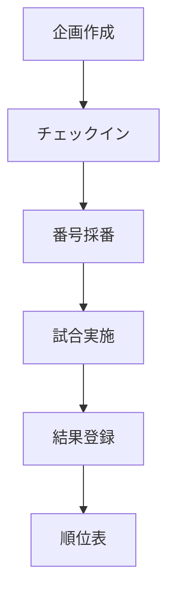

## TL;DR

- 既存の SFAD (`spec` → `test` → `impl`) では検出できなかった事故が起きた: 認可ゼロ・冪等性破綻・PII コミット
- 原因は `spec` フェーズが「機能仕様」しか扱っていなかったこと
- セキュリティ・障害耐性・実装計画も **別の軸** として扱う必要がある
- SFAD に **3 つの新しいサブスキル**を追加した: `threat` / `resilience` / `plan`
- 各サブスキルは独立した spec ファイルを生成し、`cycle` から順次オーケストレートされる
- 既存 PR への **逆引き適用 (reverse mode)** もサポート

## この記事でできること

| やりたいこと | この記事で得られるもの |
|---|---|
| SFAD を拡張するモチベーションを知りたい | 事故から仕様書テンプレを進化させる過程 |
| `threat` / `resilience` / `plan` の中身を知りたい | 各サブスキルのテンプレ全文 |
| 既存スキルを破壊せず拡張したい | サブスキル追加の進め方 |
| 既存 PR へ逆引きで仕様書を補完したい | reverse mode の使い方 |

---

## 背景: SFAD の元のサブスキル構成

[SFAD（Spec-First AI Development）](https://qiita.com/) は、BDD Discovery + Double-Loop TDD を AI 駆動開発に適応させたフレームワークです。元の構成は以下:

```
sfad:init      ← Day 0 品質基盤
sfad:spec      ← Example Mapping + Given-When-Then
sfad:test      ← 受け入れテスト + UC テスト生成
sfad:impl      ← Double-Loop TDD で Red → Green
sfad:reverse   ← 既存コードから仕様抽出
sfad:cycle     ← 上記を全自動オーケストレート
```

これで結構いい感じに回っていました。BDD でフローを言語化し、TDD でテストを先行させ、ハッピーパスもエラーパスも仕様化する。

しかし、ある日この構成では **防ぎ切れない事故** が起きました。

---

## 起きた事故（匿名化済み）

ある対戦プラットフォームに新機能を追加する PR が上がってきました。+3278 / -29 行、60 ファイル超。CI は緑、ジュニアエンジニアは「ブラウザで動いた」と PR を上げてきた。

人間レビューで見つかった問題:

| カテゴリ | 件数 | 代表例 |
|---|---|---|
| 致命的 | 4 | 全 mutation API に **認可ゼロ** / 個人情報画像 18 枚コミット / `.DS_Store` / pylint 20 個 disable |
| ロジックバグ | 10 | 採番ジョブの **冪等性破綻** / `int()` 切り捨てバグ / 60 秒同期 API ブロック |
| 設計問題 | 7 | 計算ロジックがハンドラに直書き / コード重複 / トランザクション境界なし |

詳細は別記事で書きましたが、要点は **実装者が SFAD を使っていたとしても、これらの大半は防げなかった** こと。

なぜなら、`sfad:spec` は機能仕様（誰が何をするか）にフォーカスしていて、

- **誰が叩けるか**（認可マトリクス）
- **何が壊れうるか**（失敗モード・冪等性）
- **どう作るか**（PR 分割・依存）

を構造的に強制していなかったからです。

---

## 「flow 図 = 仕様書」と思い込む罠

実装者が事前に書いていた仕様書はこうでした。

```markdown
# マルチプレイヤー対戦機能

## フロー図


## 通知一覧
| # | タイミング | テンプレート | 送信先 |
| 1 | 開始 | template-1 | チャンネル |
...

## ポイント計算
順位ポイント + (キル × 倍率)
```

一見ちゃんとしているように見える。でも、これは仕様の **30%** にすぎません。

PR で起きた問題と仕様書の項目を並べると、衝撃的な対応関係が見えます。

| 仕様書にあった | 仕様書に無かった (= PR で起きた問題) |
|---|---|
| ✅ フロー図 | ❌ 認可マトリクス → 認可ゼロ API |
| ✅ 通知一覧 | ❌ 失敗モード → 例外握りつぶし |
| ✅ ポイント計算式 | ❌ 冪等性要件 → 採番ロジック破綻 |
| ✅ チャンネル種別 | ❌ データ分類 → 個人情報画像コミット |

**「無かった項目 = 起きた問題」が因果でほぼ完全に対応**しています。AI は仕様に書かれたものは作るが、書かれていないものは作らない。これは黄金律。

---

## 拡張方針: 3 つの新サブスキル

最初は `sfad:spec` のテンプレに 5 セクション（認可・失敗モード・冪等性・データ分類・実装計画）を全部足そうと考えました。でも、これだと **1 つの spec ファイルが膨大** になって、ジュニアが完走できません。

そこで方針転換: **spec フェーズを 4 つの軸に分割** する。

```
旧:
sfad:spec → functional.md
            (5 セクション全部入りの巨大 spec)

新:
sfad:spec       → functional.md   (機能仕様)
sfad:threat     → threat.md       (認可マトリクス + データ分類)
sfad:resilience → resilience.md   (失敗モード + 冪等性 + 並行性)
sfad:plan       → plan.md         (PR 分割計画)
```

各サブスキルは **10〜15 分で完了する小さな単位**。`sfad:cycle` がこれらを順次オーケストレートします。

### なぜ分割が効くのか

1. **認知負荷が下がる** → ジュニアが完走できる。「5 セクション一気に」より「軽い 4 ステップ」の方が現実的
2. **スキップ判断ができる** → ドキュメント PR なら `spec` のみ、新規 API なら全部、リファクタなら `spec + resilience` だけ
3. **後追い適用が可能** → 既存 PR に対して `sfad:threat --reverse` だけ走らせて認可マトリクスを補完できる
4. **個別の git history** → 「いつ認可マトリクスを直したか」が独立して追える

---

## サブスキル 1: `sfad:threat`

**目的**: 認可マトリクス + データ分類を独立した artifact として出力する。

### 出力する内容

```markdown
# threat.md: マルチプレイヤー対戦

## Authorization Matrix

| 操作 | 未認証 | 一般 | 所有者 | 同組織 | 管理者 | superuser |
|---|---|---|---|---|---|---|
| GET /matches/{id}/participants | ❌ 401 | ✅ | ✅ | ✅ | ✅ | ✅ |
| POST /matches/{id}/games | ❌ 401 | ❌ 403 | - | - | ✅ | ✅ |
| PUT /matches/{id}/games/{game_id} | ❌ 401 | ❌ 403 | - | - | ✅ | ✅ |
| DELETE /matches/{id}/games/{game_id} | ❌ 401 | ❌ 403 | - | - | ✅ | ✅ |
| POST /admin/.../assign-numbers | ❌ 401 | ❌ 403 | - | - | ❌ 403 | ✅ |

## IDOR / Mass Assignment チェック

### POST /matches/{id}/games
- クライアントから受け取るフィールド: image_file
- サーバー側で設定するフィールド: id, created_by (= current_user.id), created_at
- クライアントから受け取ってはいけないフィールド: id, created_by, organization_id

## Data Classification

| データ | 分類 | 保存場所 | 配信方法 | 削除タイミング |
|---|---|---|---|---|
| 試合結果画像 | 機密 | S3 (private) | 認可付き endpoint | 90 日後 |
| ユーザー名 | 公開 | DB | API レスポンス | アカウント削除時 |

## 横断的セキュリティチェック
- [ ] CORS 制限あり
- [ ] レートリミット設定あり
- [ ] エラーメッセージから内部情報漏れない
- [ ] secrets はハードコード禁止
```

### 自動追加される Test List

```markdown
- [ ] AUTH-1: 未認証で POST /matches/{id}/games → 401
- [ ] AUTH-2: 一般ユーザーで PUT /matches/{id}/games/{game_id} → 403
- [ ] IDOR-1: 他人のリソース ID で 403
- [ ] MASS-1: 内部フィールド混入時に無視される
```

### ゲート

- 全マトリクスのセルが埋まっていない → エラー停止
- ファイルを扱うのに Data Classification が無い → エラー停止
- 「公開」と書いた項目に理由が無い → ユーザーに要求

これを通過しないと次の `sfad:resilience` に進めません。

---

## サブスキル 2: `sfad:resilience`

**目的**: 失敗モード + 冪等性 + 並行性を独立した artifact として出力する。

### 出力する内容

```markdown
# resilience.md: マルチプレイヤー対戦

## Failure Modes

| 失敗箇所 | 失敗内容 | 観測方法 | 動作 | UX | 通知 |
|---|---|---|---|---|---|
| 画像解析 AI | API キー無し | exception | parse_errors 記載、200 返却、手動入力フローへ | 「解析失敗、手動入力してください」 | ログ ERROR + Sentry |
| 画像解析 AI | タイムアウト 15s | TimeoutError | 同上 | 同上 | ログ WARN |
| 通知配信 | 1 組織失敗 | exception | 他組織は継続 | 該当組織のみ受信せず | 失敗集計ログ |
| DB | unique 違反 | IntegrityError | early return（二重実行と判定） | 影響なし | ログ INFO |

## 外部 API 設定

| API | タイムアウト | リトライ | リトライ間隔 |
|---|---|---|---|
| 画像解析 AI | 15秒 | なし | - |
| チャット通知 | 10秒 | 3 回 | 1s → 2s → 4s |
| S3 アップロード | 30秒 | 3 回 | 1s → 2s → 4s |

## Concurrency / Idempotency

| 対象 | 並行 | 二重実行 | 冪等性要件 | 実装方針 |
|---|---|---|---|---|
| ジョブ assign_team_numbers | スケジューラから 1 回 | リトライで 2 回 | 必須 | DB 制約 + early return |
| POST /matches/{id}/games | 同時 N 件 | クライアントリトライ | 不要 | unique 制約 + 1 回リトライ |
| PUT /matches/{id}/games/{game_id} | 単一 | リトライ | 必須 | upsert |
```

### 自動追加される Test List

```markdown
- [ ] FAIL-1: 画像解析 AI キー無しで POST → 200 + parse_errors
- [ ] FAIL-2: タイムアウトで POST → 200 + parse_errors
- [ ] FAIL-3: 1 組織通知失敗で他組織継続
- [ ] IDEM-1: ジョブ assign_team_numbers を 2 回実行 → participants 数が変わらない
- [ ] CONC-1: POST /matches/{id}/games を同時 5 件 → game_number 重複なし
```

### ゲート

- Failure Modes 表の全列が埋まっていない → エラー停止
- タイムアウト未指定の外部 API → エラー停止
- 「冪等性必須」と書いて実装方針が無い → エラー停止

---

## サブスキル 3: `sfad:plan`

**目的**: PR 分割計画を独立した artifact として出力する。「6000 行 PR を 1 個出して誰もレビューできない」を防ぐ。

### 出力する内容

```markdown
# plan.md: マルチプレイヤー対戦

## Implementation Plan

### PR チェーン

| # | PR タイトル | 含むもの | 行数 | 依存 |
|---|---|---|---|---|
| 1 | feat: domain types | 純粋関数 + unit test | 200 | - |
| 2 | feat: migration | 1 本（全制約含む） | 150 | - |
| 3 | feat: repositories | repo + integration test | 200 | 1,2 |
| 4 | feat: UseCase | UC + unit test (Fake) | 250 | 1,3 |
| 5 | feat: external AI client | client + Fake + unit | 200 | 1 |
| 6 | feat: API (read) | GET 系 + e2e + auth test | 200 | 4 |
| 7 | feat: API (write) | POST/PUT/DELETE + auth + idempotency test | 300 | 6 |
| 8 | feat: scheduled job | ジョブ + idempotency test | 300 | 4 |
| 9 | feat: notification templates | 追加 + 検証 | 100 | - |
| 10 | feat: integrate notification | 既存に分岐 + regression test | 150 | 8,9 |

合計: 10 PR / 約 2050 行

## In Scope
- 上記 10 PR の内容

## Out of Scope（明示）
- キャッシュ
- WebSocket リアルタイム順位表
- 多言語化
- 既存画像 ACL の presigned URL 化（後続 PR）
```

### ゲート

- 1 PR が 1000 行超 → 警告
- マイグレーションが 2 本以上 → 警告
- write 系 PR に認可テスト無し → エラー停止
- ジョブ追加 PR に冪等性テスト無し → エラー停止
- Out of Scope が空 → 警告

---

## `sfad:cycle` のオーケストレーション

```
Phase 1   Discovery (Example Mapping)            ← 既存
Phase 2   functional.md   (機能仕様)              ← /sfad spec
Phase 2.1 threat.md       (認可・データ分類)       ← /sfad threat       NEW
Phase 2.2 resilience.md   (失敗・冪等・並行)        ← /sfad resilience   NEW
Phase 2.3 plan.md         (PR 分割計画)            ← /sfad plan         NEW
Phase 3   受け入れテスト Red                       ← 既存
Phase 4-6 内側ループ TDD                          ← 既存
Phase 7   受け入れテスト Green                     ← 既存
Phase 7.5 静的解析 + セキュリティゲート             ← 既存
Phase 8   サマリー                                 ← 既存
```

各 Phase 2.x には **ユーザー承認ゲート** があります。表が埋まらないと先に進めない。これでジュニアが「とりあえず /sfad cycle 叩いた」で済ませることができなくなります。

---

## Reverse Mode（既存 PR への逆引き）

新規開発だけでなく、**既存コードへの後追い適用** もサポートしています。

```bash
/sfad threat --reverse @app/api/v1/items.py
```

これを叩くと、既存ファイルの全エンドポイントを読み取って認可マトリクスを **逆引き** します。`Depends(...)` の有無を見て、抜けがあれば赤字で表示。

```bash
/sfad resilience --reverse @app/jobs/assign_numbers.py
```

これは既存ジョブから失敗モードと冪等性を抽出。「タイムアウト未指定」「冪等性チェック無し」を赤字で表示。

これが何の役に立つかというと、**ジュニアに学習させる用途** に強い。本人が書いた PR に対して `sfad:threat --reverse` を叩くと、自分の PR の認可漏れがマトリクスとして可視化されます。「あ、自分こんなに抜けてた」が一発で分かる。

---

## 拡張前後で何が変わったか

実例として、最初の事故 PR を仮想的に再現したらどうなるかをシミュレーション:

| 致命的問題 | 旧 SFAD で防げる？ | 拡張版 SFAD で防げる？ | 防ぐ仕組み |
|---|---|---|---|
| 認可ゼロ API | ❌ | ✅ | `threat` で Authorization Matrix が空だと進めない |
| 個人情報画像コミット | ❌ | ✅ | `threat` の Data Classification + `init` の `static/` 禁止ルール |
| `.DS_Store` | ❌ | ⚠️ | `init` で `.gitignore` 整備（条件付き） |
| pylint 20 個 disable | ❌ | ⚠️ | `impl` の Refactor フェーズで理由要求（条件付き） |
| 採番冪等性破綻 | ❌ | ✅ | `resilience` で実装方針を書かないと進めない |
| `int()` 切り捨て | ❌ | ⚠️ | `resilience` の Failure Modes に「小数点ポイントは？」を書けば検出 |
| Gemini base64 不要 | ❌ | ✅ | `impl` Refactor で Context7 確認を必須化（次フェーズ） |
| 60 秒同期待ち | ❌ | ✅ | `resilience` で外部 API タイムアウト必須化 |
| discord.py private 直叩き | ❌ | ✅ | `impl` Refactor で「private 属性禁止」ルール |
| 計算ロジックコピペ | ❌ | ✅ | `impl` Refactor の重複検出チェック |
| Service 層なし | ❌ | ✅ | `plan` の PR 分割で domain/application 層が必須項目 |
| 偽物テスト 2 ファイル | ⚠️ | ✅ | Test First で本番に存在しない関数を import するテストは書けない |

完全に防げる: **8/12**、条件付き: **4/12**。致命的問題の代表（認可ゼロ・PII コミット・冪等性破綻）は確実に防げる。

---

## なぜサブスキルとして分割したか（設計判断）

最初は `sfad:spec` 1 つに全部詰めるか迷いました。最終的に分割した理由:

### 1. 認知負荷

「5 セクションの spec を一気に書く」だと実装者が完走できない。10 分の軽いステップ × 4 回の方が現実的。

### 2. スキップ可能性

ドキュメント PR や内部リファクタでは threat/resilience/plan の一部が不要。分割していれば必要なものだけ走らせられる。1 つに詰まっていると全部書かないといけない。

### 3. 後追い適用

既存 PR に対して「認可マトリクスだけ補完したい」「失敗モードだけ補完したい」というニーズがある。分割していれば `sfad:threat --reverse` だけ叩ける。

### 4. git history の独立性

「いつ認可マトリクスを追加したか」「いつ失敗モードを追加したか」が独立して追える。1 つの spec ファイルだとコミット履歴が雑になる。

### 5. ゲートの粒度

「Authorization Matrix が空なら進めない」「Failure Modes が空なら進めない」のゲートをサブスキル単位で設けられる。1 つに詰まっているとゲートが粗くなる。

---

## 既存スキルへの影響

破壊的変更を避けるために以下を守りました:

1. **`sfad:spec` の挙動は変えない**（functional.md だけを生成）
2. **既存の `sfad:cycle` フローは互換性保持**（新フェーズを後ろに追加するだけ）
3. **既存の reverse mode に追加実装を被せる**（既存 reverse は壊さない）
4. **新規ファイルとして 3 ファイル追加**（`threat.md` `resilience.md` `plan.md`）

これにより、既存利用者は何も意識せず `sfad:cycle` を叩くだけで自動的に新フローに乗ります。個別利用者だけ「`sfad:spec` の挙動が縮小した」点を意識すれば OK。

---

## まとめ

- 既存 SFAD の `sfad:spec` は「機能仕様」しか扱っておらず、認可・失敗モード・冪等性・データ分類が抜けていた
- 結果として「flow 図はあるけど認可ゼロ」「冪等性破綻」「PII コミット」のような事故が起きた
- 拡張: **3 つの新サブスキル**を追加した
  - `sfad:threat` → 認可マトリクス + データ分類
  - `sfad:resilience` → 失敗モード + 冪等性 + 並行性
  - `sfad:plan` → PR 分割計画
- 各サブスキルは **独立した spec ファイル** を生成、`cycle` から順次オーケストレート
- **Reverse Mode** で既存 PR への後追い適用も可能
- 拡張版 SFAD で、最初の事故 PR の致命的問題は **4/4 防げる** ようになった

スキル拡張の作業は実質 **3〜4 時間**。やるべきだった、と心から思います。次は `sfad:init` の品質チェックリストに secrets / ACL / PII 項目を追加する予定です。

---

スキル設定は以下に置いています。SFAD を試してみたい方の参考になれば。

- `~/.claude/skills/sfad/threat.md`
- `~/.claude/skills/sfad/resilience.md`
- `~/.claude/skills/sfad/plan.md`

スキル拡張は決して難しくありません。**事故から学んで仕様書テンプレを進化させる**、これだけです。
